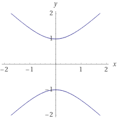

# a

$$u^2 - v^2 = 1$$
$$P = (u_0, v_0) = (1, 0)$$
$$u = 1 + t, v = mt$$
Substituting in, we get
$$2 + (1 - m^2) t = 0$$
$$t = \frac{2}{1 - m^2}$$

```python
sage: t, m = var("t m")
sage: u = 1 + t
sage: v = m * t
sage: a = u^2 - v^2 == 1
sage:
sage: a
-m^2*t^2 + (t + 1)^2 == 1
sage: a = a.expand() - 1
sage: a
-m^2*t^2 + t^2 + 2*t == 0
sage: a /= t; a
-(m^2*t^2 - t^2 - 2*t)/t == 0
sage: a = a.expand(); a
-m^2*t + t + 2 == 0
sage: solve(a, t)
[t == 2/(m^2 - 1)]
sage: t = solve(a, t)[0].rhs()
sage: t
2/(m^2 - 1)
sage: (1 + t).expand()
2/(m^2 - 1) + 1
sage: (1 + t).simplify_full()
(m^2 + 1)/(m^2 - 1)
sage: (m*t).simplify_full()
2*m/(m^2 - 1)
```

# b

$$u^2 = v^2$$
$$\implies u = \pm v$$
$$(v : v : 0) = (1 : 1 : 0)$$
$$(-v : v : 0) = (-1 : 1 : 0) = (1 : -1 : 0)$$

# c

Let $m = 1$, then $(m^2 + 1 : 2m : m^2 - 1) = (2 : 2 : 0) = (1 : 1 : 0)$.
Let $m = -1$, then $P = (2 : -2 : 0) = (1 : -1 : 0)$.

This indicates the 2 intersections of the asymptotes for the hyperbola at $y = x$ and $y = -x$.


